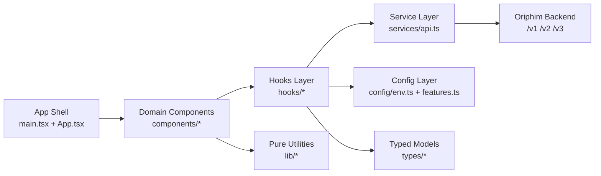

# Oriphim Client Dashboard

Production-grade React dashboard for Oriphim validation platform.

## Architecture

- **Framework:** React 18 + TypeScript
- **Build:** Vite 7
- **State:** Zustand
- **Styling:** Tailwind CSS + Radix UI
- **API Client:** Axios
- **Charts:** Recharts

### Architecture Diagram



### Runtime Flow

```text
Browser UI (components/*)
	-> hooks/* (stateful UI logic)
	-> services/api.ts (HTTP boundary)
	-> FastAPI backend (/v2, /v3, /v1/onboarding)
	-> typed models in types/* returned to UI
```

### Folder Interaction Map

```text
src/App.tsx + src/main.tsx
	-> components/* (domain UI)
	-> hooks/* (auth, health, validations)
	-> services/* (endpoint wrappers)
	-> config/* (runtime env + feature flags)
	-> lib/* (pure utilities/constants)
```

## Quick Start

```bash
# Install dependencies
npm install

# Start dev server
npm run dev

# Production build
npm run build

# Type check
npm run type-check

# Lint
npm run lint

# Lint (strict, zero warnings)
npm run lint:strict

# Unit tests
npm run test:unit
```

## Environment Setup

Copy `.env.example` to `.env.local` and configure:

```bash
VITE_API_BASE_URL=http://localhost:8000
VITE_API_TIMEOUT=30000
```

### Environment Variable Reference

| Variable | Required | Default | Description |
| --- | --- | --- | --- |
| `VITE_API_BASE_URL` | No | `http://localhost:8000` | Backend base URL used by `services/api.ts`. |
| `VITE_API_TIMEOUT` | No | `30000` | HTTP timeout (ms) for API client requests. |
| `VITE_POLLING_INTERVAL_MS` | No | `2000` | Generic polling interval (ms) for periodic UI refresh loops. |
| `VITE_HEALTH_CHECK_INTERVAL_MS` | No | `2000` | Poll interval (ms) for health status checks. |
| `VITE_AUTH_TOKEN_STORAGE_KEY` | No | `oriphim_access_token` | Local storage key for access token persistence. |
| `VITE_REFRESH_TOKEN_STORAGE_KEY` | No | `oriphim_refresh_token` | Local storage key for refresh token persistence. |
| `VITE_FEATURE_VERBOSE_API_ERRORS` | No | `false` | Enables verbose client-side API error details when true. |
| `VITE_FEATURE_INTEGRATION_WORKSPACE` | No | `true` | Enables/disables Integration workspace UI paths. |

## Project Structure

See [ORGANIZATION.md](ORGANIZATION.md) for production-grade folder organization blueprint, migration waves, and acceptance criteria.

**Key domains:**
- `src/components/` - UI components by domain (Auth, Audit, Onboarding, Status, Validations, Incidents)
- `src/services/` - API client layer
- `src/hooks/` - React hooks for data fetching and state
- `src/store/` - Zustand global state
- `src/types/` - TypeScript interfaces

## Development

**Type Safety:**
```bash
npm run type-check  # Must pass before commit
npm run lint:strict # Must pass with zero warnings
```

**Pre-commit Gate (Husky):**
```bash
# Automatically runs before every commit
npm run type-check && npm run lint:strict
```

**Testing:**
```bash
npm run test        # Unit tests (Vitest)
npm run test:e2e    # E2E tests (when configured)
```

**Bundle Analysis:**
```bash
npm run build -- --analyze
```

## Production Deployment

```bash
# Build optimized bundle
npm run build

# Preview production build locally
npm run preview

# Deploy dist/ folder to CDN/hosting
```

## Contributing

1. Follow structure in [ORGANIZATION.md](ORGANIZATION.md)
2. All components must be TypeScript strict mode
3. Use Tailwind utilities; avoid custom CSS
4. API calls only in `services/` layer
5. Business logic in `lib/`, not components

## Documentation

- [Organization Blueprint](ORGANIZATION.md) - Folder structure and rules
- [API Integration Guide](../docs/guides/CLIENT_INTEGRATION.md) - Backend integration
- [Dashboard Build Guide](../docs/guides/DASHBOARD_BUILD_GUIDE.md) - Deployment
- [Auth Domain Guide](src/components/Auth/README.md) - Auth component usage and boundaries
- [Status Domain Guide](src/components/Status/README.md) - Health/status UI contracts
- [Validations Domain Guide](src/components/Validations/README.md) - Validation table and detail flows

## Stack Details

Built with Vite + React. Uses [@vitejs/plugin-react](https://github.com/vitejs/vite-plugin-react) with Babel for Fast Refresh.

For ESLint type-aware configuration and React Compiler setup, see [ORGANIZATION.md](ORGANIZATION.md) Wave 3.
